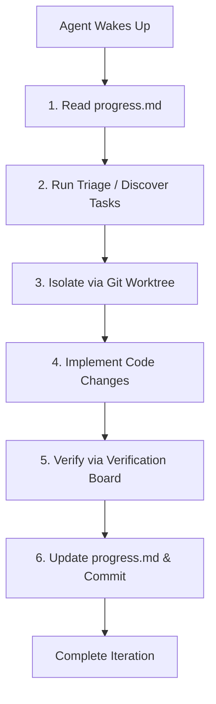

# Workspace Rules & Guidelines: Loop Engineering

Welcome, agent. This workspace is configured to support **Loop Engineering** (continuous, automated iterations of discovery, isolation, implementation, and verification). You must adhere to the rules and workflow lifecycle defined here.

---

## 🧭 The Loop Engineering Lifecycle

When you are spawned in this workspace (whether by a scheduled cron trigger, a `/goal` run-until-done request, or user direction), you must execute these steps sequentially:

---

## 📋 Core Rules for Agents

### 1. State Maintenance is Mandatory
- **Read First**: Your very first action MUST be to view [progress.md](file:///C:/Users/strmshdw/.gemini/antigravity-ide/scratch/loop-engineering-workspace/progress.md) to understand current active tasks, branches, and backlog items.
- **Update Frequently**: Whenever you start a task, complete a task, encounter an error, or create a worktree, update `progress.md` immediately. Never leave the workspace state stale.

### 2. Parallel Worktree Isolation
- Never commit directly to the `main` branch unless it is for administrative configurations (like updating this file or `progress.md`).
- For any code feature or bug fix, you must create a new branch in a dedicated **Git Worktree**. This isolates your changes so that other concurrent agent runs do not conflict with your edits.
- Register your worktree in the "Active Worktrees" table in `progress.md`.
- Once changes are complete and verified, push the worktree branch and submit a pull request (or request review), then prune/delete the worktree.

### 3. Maker/Checker Verification Split
- You are responsible for writing and checking your own work, but you must treat verification as a formal gate.
- Before claiming a task is done, you must execute the automated test suites or run scripts specified in the "Verification Board" table in `progress.md`.
- If a task requires a verification review, spawn or recommend a sub-agent with a `verification` prompt to check the files before merging.

### 4. Intentional Error Logging
- If a build, test, or automation run fails, document the failure details in the "Triage Inbox & Backlog" with a `[!] Failed` status, including a brief explanation of the failure so subsequent loop runs can pick it up.

---

## 🛠️ Custom Skills Available
You have workspace-scoped skills to automate parts of this lifecycle:
- `$triage`: Scans the workspace (Git logs, issues, or custom tasks) and populates the triage board in `progress.md`.
- `$worktree-isolation`: Automates setting up and cleaning up Git worktrees.
- `$verification`: Automates running test suites and checking code changes.
